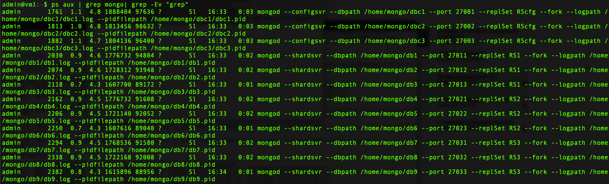
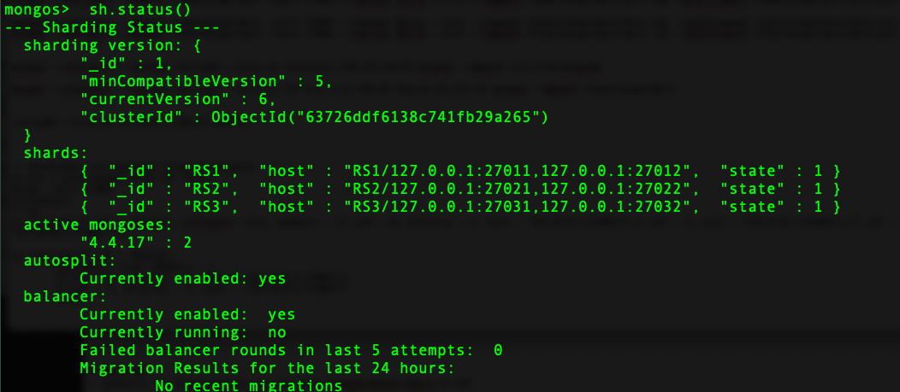
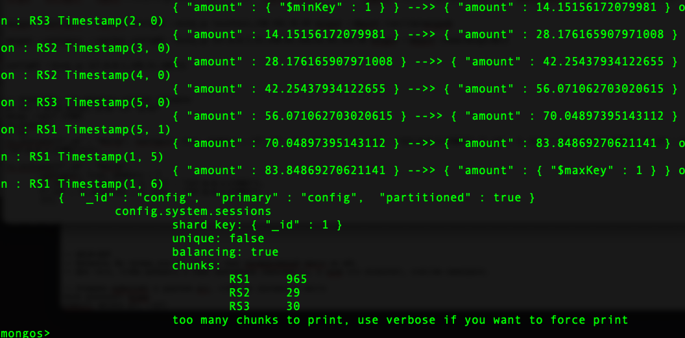

#Домашняя работа 6

###Установка mongo
wget -qO - https://www.mongodb.org/static/pgp/server-4.4.asc | sudo apt-key add - && echo "deb [ arch=amd64,arm64 ] https://repo.mongodb.org/apt/ubuntu focal/mongodb-org/4.4 multiverse" | sudo tee /etc/apt/sources.list.d/mongodb-org-4.4.list && sudo apt-get update && sudo apt-get install -y mongodb-org

###Создадим репликасет с конфигурацией шарда

```
sudo mkdir /home/mongo && sudo mkdir /home/mongo/{dbc1,dbc2,dbc3} && sudo chmod 777 /home/mongo/{dbc1,dbc2,dbc3}
```

```
mongod --configsvr --dbpath /home/mongo/dbc1 --port 27001 --replSet RScfg --fork --logpath /home/mongo/dbc1/dbc1.log --pidfilepath /home/mongo/dbc1/dbc1.pid
mongod --configsvr --dbpath /home/mongo/dbc2 --port 27002 --replSet RScfg --fork --logpath /home/mongo/dbc2/dbc2.log --pidfilepath /home/mongo/dbc2/dbc2.pid
mongod --configsvr --dbpath /home/mongo/dbc3 --port 27003 --replSet RScfg --fork --logpath /home/mongo/dbc3/dbc3.log --pidfilepath /home/mongo/dbc3/dbc3.pid
```

###посмотрим, что процессу успешно запущены
ps aux | grep mongo| grep -Ev "grep"


mongo --port 27001

```
rs.initiate({"\_id" : "RScfg", configsvr: true, members : [{"_id" : 0, priority : 3, host : "127.0.0.1:27001"},{"_id" : 1, host : "127.0.0.1:27002"},{"_id" : 2, host : "127.0.0.1:27003"}]});
```

###Создадим 3 репликасета

```
sudo sudo mkdir /home/mongo/{db1,db2,db3,db4,db5,db6,db7,db8,db9} && sudo chmod 777 /home/mongo/{db1,db2,db3,db4,db5,db6,db7,db8,db9}
```

```
mongod --shardsvr --dbpath /home/mongo/db1 --port 27011 --replSet RS1 --fork --logpath /home/mongo/db1/db1.log --pidfilepath /home/mongo/db1/db1.pid
mongod --shardsvr --dbpath /home/mongo/db2 --port 27012 --replSet RS1 --fork --logpath /home/mongo/db2/db2.log --pidfilepath /home/mongo/db2/db2.pid
mongod --shardsvr --dbpath /home/mongo/db3 --port 27013 --replSet RS1 --fork --logpath /home/mongo/db3/db3.log --pidfilepath /home/mongo/db3/db3.pid

mongod --shardsvr --dbpath /home/mongo/db4 --port 27021 --replSet RS2 --fork --logpath /home/mongo/db4/db4.log --pidfilepath /home/mongo/db4/db4.pid
mongod --shardsvr --dbpath /home/mongo/db5 --port 27022 --replSet RS2 --fork --logpath /home/mongo/db5/db5.log --pidfilepath /home/mongo/db5/db5.pid
mongod --shardsvr --dbpath /home/mongo/db6 --port 27023 --replSet RS2 --fork --logpath /home/mongo/db6/db6.log --pidfilepath /home/mongo/db6/db6.pid

mongod --shardsvr --dbpath /home/mongo/db7 --port 27031 --replSet RS3 --fork --logpath /home/mongo/db7/db7.log --pidfilepath /home/mongo/db7/db7.pid
mongod --shardsvr --dbpath /home/mongo/db8 --port 27032 --replSet RS3 --fork --logpath /home/mongo/db8/db8.log --pidfilepath /home/mongo/db8/db8.pid
mongod --shardsvr --dbpath /home/mongo/db9 --port 27033 --replSet RS3 --fork --logpath /home/mongo/db9/db9.log --pidfilepath /home/mongo/db9/db9.pid
```

mongo --port 27011

```
rs.initiate({"\_id" : "RS1", members : [{"_id" : 0, priority : 3, host : "127.0.0.1:27011"},{"_id" : 1, host : "127.0.0.1:27012"},{"_id" : 2, host : "127.0.0.1:27013", arbiterOnly : true}]});
```

mongo --port 27021

```
rs.initiate({"\_id" : "RS2", members : [{"_id" : 0, priority : 3, host : "127.0.0.1:27021"},{"_id" : 1, host : "127.0.0.1:27022"},{"_id" : 2, host : "127.0.0.1:27023", arbiterOnly : true}]});
```

mongo --port 27031

```
rs.initiate({"\_id" : "RS3", members : [{"_id" : 0, priority : 3, host : "127.0.0.1:27031"},{"_id" : 1, host : "127.0.0.1:27032"},{"_id" : 2, host : "127.0.0.1:27033", arbiterOnly : true}]});
```

ps aux | grep mongo| grep -Ev "grep"

###запускаем в 3 экземплярах для отказоустойчивости

```
mongos --configdb RScfg/127.0.0.1:27001,127.0.0.1:27002,127.0.0.1:27003 --port 27000 --fork --logpath /home/mongo/dbc1/dbs.log --pidfilepath /home/mongo/dbc1/dbs.pid
mongos --configdb RScfg/127.0.0.1:27001,127.0.0.1:27002,127.0.0.1:27003 --port 27100 --fork --logpath /home/mongo/dbc1/dbs2.log --pidfilepath /home/mongo/dbc1/dbs2.pid
```

mongo --port 27000

```sh.addShard("RS1/127.0.0.1:27011,127.0.0.1:27012,127.0.0.1:27013")
sh.addShard("RS2/127.0.0.1:27021,127.0.0.1:27022,127.0.0.1:27023")
sh.addShard("RS3/127.0.0.1:27031,127.0.0.1:27032,127.0.0.1:27033")
sh.status()
```



###Загрузка данных

```
use bank
sh.enableSharding("bank")
use config
db.settings.save({ \_id:"chunksize", value: 1})
use bank
for (var i=0; i<100000; i++) { db.tickets.insert({name: "Max ammout of cost tickets", amount: Math.random()\*100}) }
db.tickets.createIndex({amount: 1})
db.tickets.stats()
sh.shardCollection("bank.tickets",{amount: 1})
-- use admin
-- db.runCommand({shardCollection: "bank.tickets", key: {amount: 1}})
sh.status()
```



```
sh.balancerCollectionStatus("bank.tickets")
> sh.splitFind( "bank.tickets", { "amount": "50" } )
```
